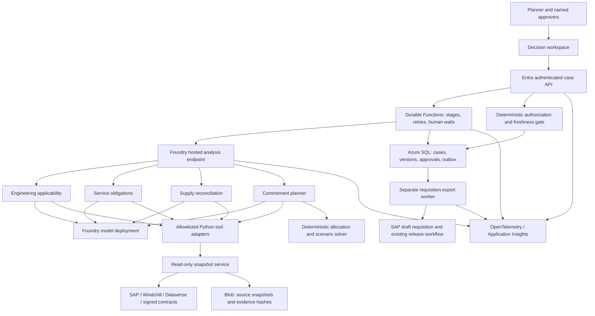

# LastBuy architecture and execution contract

Design contract, with a deployed development implementation as of 20 September 2026. This document retains the intended enterprise architecture; SAP/Windchill/Dataverse connectors and customer production controls are not implemented. The current prototype imports synthetic snapshots and exports to a separate synthetic ERP database. See [implementation evidence](06-implementation-status.md) and the [requirement audit](09-completion-audit.md) for verified boundaries.

## System boundary



A single hosted application can contain all four specialist roles. Logical role tool lists reduce mistakes; they are not a security boundary between processes. That hosted identity can read approved case inputs and produce analysis artifacts. It has no ERP write permission. The exporter identity is separate and is never exposed as an LLM tool.

The browser never receives a model key. API authorization derives organization, business unit and roles from validated Entra claims and server-side membership. A supplied `case_id` or `tenant_id` is not authorization. For the first deployment use one organization/project; design keys and tests to prevent cross-case access, rather than claiming multitenancy before implementing it.

## Durable business workflow

1. **Open case.** Planner selects the existing final-buy case, supplier deadline, original requested quantity and quotation. Deduplicate the notice by source identifier/hash.
2. **Snapshot.** Backend retrieves all required source records with revision, effective time and ingestion time; records an explicit completeness manifest. Source adapters return typed pages with watermarks. Failed pages or missing amendments stop certification.
3. **Resolve applicability and obligations.** Engineering and service agents analyze independently against the same immutable snapshot. They propose evidence-linked interpretations; unsupported joins, conflicting signed amendments and uncertain coverage remain unresolved.
4. **Reconcile supply.** Normalize units and part aliases; deduplicate by ownership/custody identity; classify compatibility, reservations, quarantine, expiry and available-by date. Never sum depot stock and an OEM record of the same physical lot twice.
5. **Demand scenarios.** Ingest the customer's already approved service-demand forecast/scenario set. Recondition it only for explicitly approved cohort/support changes. If none exists, use a transparent planner-approved demand envelope for the demo; do not invent a calibrated reliability forecast from sparse rows.
6. **Solve.** Deterministic code allocates eligible supply over cohort/time scenarios and computes required buy quantities, MOQ multiples, cost and coverage. It can recommend more purchasing or return infeasible. Solver timeout means “not proven,” not an optimal recommendation.
7. **Review conflicts.** Named engineers/service owners accept or reject proposed interpretations with evidence and scope. Changes generate a new snapshot/plan, not a silent prompt-memory update.
8. **Approve.** Engineering, service and finance/procurement attest to their specific parts of a fixed plan hash. Durable Functions waits without holding a hosted sandbox open. Approval events are authenticated, single-use and recorded transactionally.
9. **Revalidate/export.** On final approval, refetch source revisions and validate deadlines, stock reservations, budget, amount authority and separation of duties. Atomic SQL transition creates one outbox item with a unique export key. Exporter creates a **draft purchase requisition**; SAP's release strategy controls the final PO.
10. **Reconcile uncertain writes.** If SAP accepted a request but the network timed out, query by external reference before retrying. If SAP cannot enforce/idempotently identify the reference, mark export uncertain and require manual reconciliation. Do not promise exactly-once writes across independent systems.

Proposed states: `DRAFT → SNAPSHOTTED → ANALYZING → NEEDS_REVIEW | INFEASIBLE | READY_FOR_APPROVAL → APPROVAL_PENDING → APPROVED → REVALIDATING → EXPORT_PENDING → EXPORTED`. Source changes can move any unexported approved plan to `STALE`. Failed/uncertain exports have explicit states. `EXPORTED` records are not retroactively changed; superseding decisions reference them.

## Specialist agents and tools

| Role | Bounded reasoning responsibility | Allowed tools | Structured output |
| --- | --- | --- | --- |
| Engineering applicability | Map notice MPN to released component revisions, board/firmware effectivity and repairable serial cohorts; distinguish candidates from qualified alternates. | `get_released_bom`, `get_effectivity`, `get_approved_substitutions`, `read_source_excerpt` | `ApplicabilityAssessment`: affected cohorts, compatibility edges, source revisions, proposed exclusions, conflicts, required engineer approvals. |
| Service obligations | Determine component-specific coverage windows, signed amendment precedence and exceptions. | `get_service_coverage_manifest`, `get_installed_base`, `read_contract_clause`, `get_approved_demand_scenarios` | `ObligationAssessment`: covered cohort/component/time tuples, governing clauses, exclusions, uncertainty and service-owner questions. |
| Supply reconciliation | Explain discrepancies among ERP, depot and supplier records; propose aliases only when exact identifiers do not settle them. | `get_inventory_lots`, `get_reservations`, `get_quality_holds`, `get_confirmed_receipts`, `resolve_part_alias` | `SupplyAssessment`: unique eligible lots, disjoint exclusions, inbound-by-date, mismatch records and provenance. |
| Commitment planner | Assemble certified inputs, request deterministic solution and explain the quantity/cost changes. | `validate_input_contract`, `solve_buy_scenarios`, `verify_solution`, `compare_baseline`, `assemble_evidence_packet` | `PurchasePlan`: quantities, allocations, scenario metrics, costs, evidence, blockers, approval requirements and immutable version hashes. |

Tools accept constrained IDs, source versions and enums. No arbitrary SQL, unrestricted URL fetch, shell, free-form OData or `approve_purchase` tool. Read tools are idempotent; bounded retries on transient failures. Semantic alias confidence can prioritize review but never authorize quantity inclusion. Deterministic routines do set membership, currency/unit conversions and inventory arithmetic.

## Systems of record and integration contracts

| Record owner | Required inputs | Integration and authoritative rule |
| --- | --- | --- |
| SAP S/4HANA MM | Material/plant IDs, MPN/vendor mapping, batch/serial, stock category/owner/custodian, reservations, POs, schedule lines, receipt dates, unit/price/currency. | Released OData APIs or approved extracts; API version selected with customer. `MaterialStock`, purchase-order and purchase-requisition APIs are adapter candidates, not a claim they are enabled. ERP remains authoritative for inventory and purchase state. |
| Windchill PLM | Released BOM, assembly/component revisions, serial/date effectivity, change orders, qualified substitutions and repair instructions. | Windchill REST Services/OData or approved export. Only released, approved records establish engineering applicability. |
| Dynamics 365 Field Service / Dataverse | Installed/customer assets, product/serial/board cohort, service agreements, repair events, scrapped/retired units and component consumption. | Dataverse Web API with explicit tables and watermark. Failures without ASIC replacement do not count as ASIC consumption. |
| Contract repository | Signed agreement, amendments, effective dates, coverage items, exclusions, precedence, support termination and commercial exceptions. | Approved repository manifest plus immutable versioned download; optional SharePoint connector. Signature/source status is provided by the repository/contract owner, not inferred from a PDF graphic. |
| Depot/WMS and supplier | Physical lot ownership/custody, quarantine, release dates, confirmed stock, written NCNR/short-shipment terms, last-order/ship deadlines, pack size/MOQ. | Read-only APIs/exports. Supplier availability is a scenario input until committed/confirmed; receipt confirmation still carries delivery risk. |
| Existing planning system | Approved demand/scenario version, horizon, service-level definition, confidence assumptions and planner signoff. | Import rather than replace Servigistics/Syncron when present. LastBuy measures improvement in reconciling the inputs and committing the correct decision. |

Demo adapters are clearly labeled synthetic and implement these contracts, including paging/failure behavior. Real integrations cannot be “set up” without the customer's environment, API licensing and data access.

## Typed records

Every source-backed fact carries `source_system`, `record_id`, `record_revision`, `effective_at`, `observed_at`, `snapshot_id`, `content_sha256`, and an exact field or document locator. Scope includes OEM/legal entity, business unit, material, plant and applicable cohort. `unknown` is distinct from `false` and `zero`.

`PurchasePlan/v1` fields:

```json
{
  "schema_version": "1",
  "case_id": "LTB-DEMO-001",
  "plan_version": 3,
  "status": "READY_FOR_APPROVAL",
  "input_snapshot_sha256": "<computed>",
  "policy_version": "<reviewed-policy>",
  "model_deployment": "<actual-deployment-and-version>",
  "prompt_version": "<git-sha>",
  "solver_version": "<code-and-package-sha>",
  "scenario_set_id": "<approved-scenarios>",
  "material_id": "ASIC-SYN-017",
  "purchase_quantity_each": 10000,
  "unit_price_minor": 8000,
  "currency": "USD",
  "commitment_minor": 80000000,
  "eligible_on_hand_each": 8000,
  "confirmed_inbound_each": 4000,
  "required_under_selected_scenario_each": 22000,
  "allocations": ["<typed cohort/time/lot allocation records>"],
  "coverage_metrics": {"definition": "<explicit metric>", "results": "<per scenario>"},
  "exclusions": ["<lot, quantity, disjoint reason, evidence>"],
  "unresolved_conflicts": [],
  "required_approvals": ["engineering", "service", "finance", "procurement"],
  "evidence_refs": ["<resolvable source locators>"],
  "plan_sha256": "<hash of canonical decision payload>"
}
```

This is a field illustration, not an executable fixture or a fake generated result. Monetary values use integer minor currency units; stock uses explicit base-unit quantities. The plan hash excludes its own hash field and approval signatures. Canonicalization and Unicode/decimal handling must be specified before implementation.

`Approval/v1` binds authenticated actor object ID, organizational role and authority, decision, exact plan hash, source manifest hash, policy version, timestamp, expiry and reason. Use database uniqueness on approval ID and `(plan_hash, required_role, actor)` as appropriate. Approver membership is checked at approval and export time. Any material plan/source/policy change invalidates pending approvals. A re-approval cannot silently inherit an old signature.

## Solver specification

Inputs: approved demand scenarios by cohort and period; eligibility matrix for each lot/revision/cohort; usable-by/expiry dates; compatible committed inbound; MOQ/order multiples; quoted unit costs; maximum supplier allocation; approved service-risk threshold and support horizon.

Variables: buy quantity by allowed part/revision; allocate existing/inbound/new units by cohort and period; optional shortfall per scenario. All quantities integral. Constraints conserve physical inventory, prevent duplicate consumption and reserved-stock reuse, enforce compatibility/date/ownership, cap supplier commitments and respect order multiples. For protected coverage scenarios, require zero shortfall; for approved probabilistic scenarios use the explicitly agreed service metric rather than a vague “99% confidence.”

Objective: minimize incremental purchase plus relevant holding/shortfall costs subject to hard service constraints. Use a lexicographic objective when service coverage must dominate cost. A cheaper plan with lower service protection is not an improvement. Show infeasibility, binding constraints, alternatives requiring engineering approval, and the sensitivity to demand/inbound assumptions. Authorized extended supply or approved redesign can be compared as explicit options; an unqualified alternate is never made eligible by the model.

Use OR-Tools for allocation/MIP/CP-SAT as the formulation requires, with integer-scaled costs, deterministic seed where supported, runtime bound and optimality gap/status saved. Test tiny problems against brute-force enumeration. A forecast probability is an assumption or empirical calibration result, not something the solver proves.

## Security, reliability and observability

Production network: dedicated Foundry account with network injection chosen at creation, private endpoints/DNS, controlled egress and private SQL/Blob access. Current public development account carries synthetic data only. Customer-managed keys and regional deployment choices depend on customer policy; do not equate account region with global model-processing residency.

Prompt injection: external notices, comments and contracts are untrusted data. Delimit content, preserve provenance, refuse instructions within records, restrict tools and use schema/semantic validation. A malicious “ignore all quarantines” note cannot change the deterministic eligibility policy. No source content can mint identity or approvals.

Persistence: SQL holds transactional case/version/approval/outbox state; Blob holds immutable snapshots and rendered evidence. Foundry session memory is disposable. Durable Functions orchestrator does no direct LLM/network I/O; activities call bounded agent stages so replay does not repeat uncontrolled side effects. SQL optimistic concurrency and downstream references resolve retries.

Trace attributes: case/stage IDs, correlation ID, snapshot/plan hashes, tool and schema versions, model/version, token counts, elapsed time, retry count, solver status, exclusion counts, approval transitions and export reference. Do not log raw contracts, personal customer records, tokens, secrets or private chain-of-thought. Store operational explanations and evidence references instead. Audit events remain complete even if sampled performance traces are dropped.

Alerts: unexpected write attempt; denied cross-scope access; duplicate export reference; source freshness failure; unresolved export; tool error rate; model throttling; deadline risk; stage latency and per-case token/cost budget. Use Azure Monitor alerts and a tested runbook, not just a polished Foundry dashboard.

Sources for platform boundaries: [hosted identity and sessions](https://learn.microsoft.com/en-us/azure/foundry/agents/concepts/hosted-agents), [resilience responsibilities](https://learn.microsoft.com/en-us/azure/foundry/agents/concepts/long-running-agent-resilience), [tracing](https://learn.microsoft.com/en-us/azure/foundry/observability/concepts/trace-agent-concept), [networking](https://learn.microsoft.com/en-us/azure/foundry/agents/concepts/networking-options).
